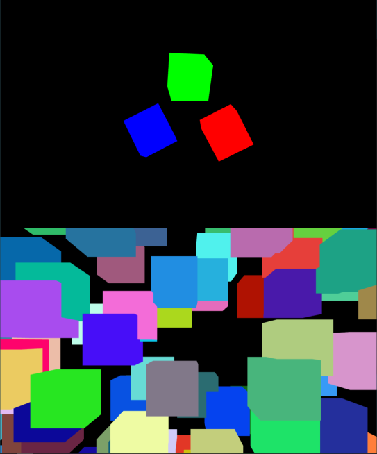

# WebGL Renderer

A WebGL renderer project for me to play around with.

## Setup

1. Clone project `git clone https://github.com/brianpmaher/webgl-renderer.git`
2. Open directory `cd webgl-renderer`
3. Install dependencies `npm i`
4. Run project `npm run dev`
